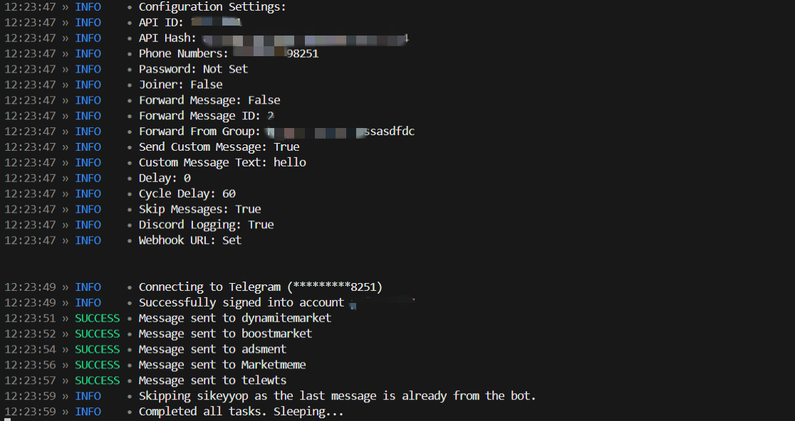
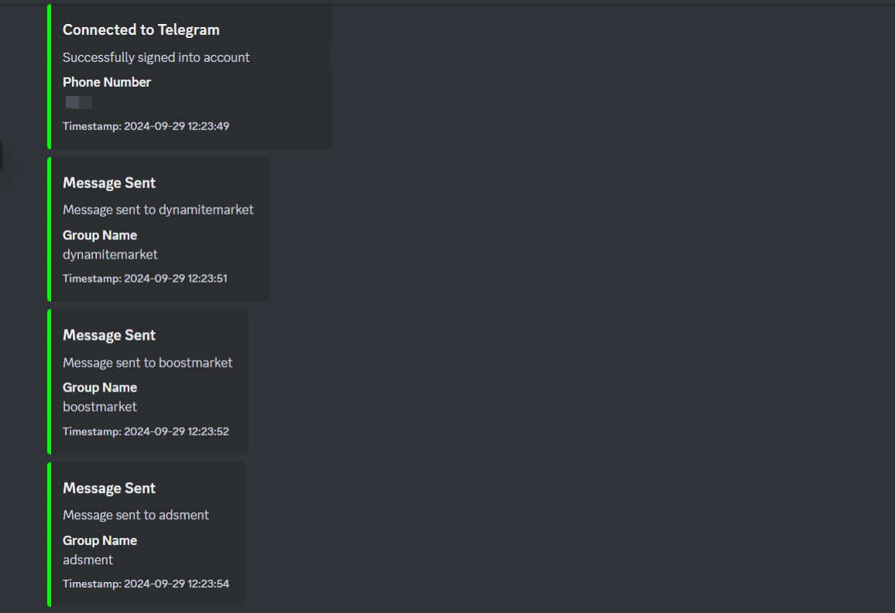

**Telegram Ad Bot**

*This Telegram bot automates message forwarding and custom message sending in multiple groups, featuring session management, group joining, and configuration-based control. Additionally, it logs important activities in a beautifully formatted Discord embed using a webhook.*





**Features:**

*Custom Message Broadcasting*

*Message Forwarding*

*Group Joiner*

*Session Management*

*Rate-Limit Handling*

*Message Skipping*

*Cycle Automation*

*Advanced Configuration Options*

*Real-Time Status Updates*

*Discord Webhook Integration*

*Configuration Display*

*Error Logging and Handling*

*Two-Factor Authentication Support*


**Configuration Setup**

1. `config.toml` file is used for configuration settings.
2. Make sure the structure is like below:

```toml
[telegram]
api_id = "your_api_id_here"
api_hash = "your_api_hash_here"
phone_numbers = ["your_phone_number_here"]
password = "optional_password_for_two_factor"

[settings]
joiner = false
forward_message = false
forward_message_id = "message_id_to_forward"
forward_from_group = "group_url_to_forward_from"
send_custom_message = true
custom_msg_text = "The message to send in groups"
delay = 2  # Delay between sending messages (in seconds)
cycle_delay = 60  # Delay between cycles (in seconds)
skip_msg = true  # Skip sending if the last message is from the bot

[logging]
discord_logging = true
webhook_url = "your_discord_webhook_url_here"

[show_settings]
print_settings = true  # Print settings in the console
webhook_settings = true  # Send settings to the Discord webhook
```

**Setup and Installation**

1. **Install Requirements**

(a) _Install Python if you haven't already. [Download Python](https://www.python.org/downloads/)_

(b) Install the required modules using:

```
pip install -r requirements.txt
```

2. **Configure Your Bot**

*Open ```config.toml```*

*Replace the placeholders in the [telegram] section with your Telegram API ID, API Hash, and Phone Number.*

*Customize the [settings] section as needed.*

3. **Running the Script**

*Open a terminal or command prompt and run:*
```py
python main.py
```

**How to Use**

*Session Management: If this is your first run, it will prompt for a login code. Enter the verification code sent to your Telegram number.*

*Message Forwarding and Sending: Based on your settings in the configuration file, the bot will either send custom messages or forward the specified message.*

*Logging to Discord: If ```discord_logging``` is enabled, activities will be logged to your specified Discord webhooks.*


ㅤ


**Configuration Options Explained**

**API ID & Hash:** *Credentials from [my.telegram.org](https://my.telegram.org/) used to authenticate your bot.*

**Phone Numbers:** *The phone numbers associated with your Telegram accounts.*

**Password:** *Optional, only if your account uses two-factor authentication.*

**Joiner:** *If set to `true`, the bot will join the groups in `groups.txt`.*

**Forward Message:** *If set to `true`, forwards a message from the group specified in `forward_from_group` to all the groups in `groups.txt`. Requires `forward_message_id` to identify the message ID to be forwarded*

**Forward From Group:** *The URL of the group from which messages should be forwarded.*

**Forward Message ID:** *The specific message ID to be forwarded from the `forward_from_group`.*

**Send Custom Message:** *If set to `true`, the bot will send the message specified in `custom_msg_text` to all the groups listed in `groups.txt`.*

**Custom Message Text:** *The content of the custom message to be sent if `send_custom_message` is enabled.*

**Delay:** *The time delay (in seconds) between sending messages to different groups to avoid rate limits.*

**Cycle Delay:** *Time (in seconds) between completing one full cycle of all tasks and starting a new cycle.*

**Skip Messages:** *If set to `true`, the bot will skip sending a message if the last message in a group was already sent by the bot.*

**Discord Logging:** *If set to `true`, the bot will send activity logs to the specified Discord webhook.*

**Webhook URL:** *The Discord webhook URL used for logging activities in the bot.*

**Print Settings:** *If set to `true`, the bot will print out all the configuration settings in the console when starting.*

**Webhook Settings:** *If set to `true`, the bot will send the current configuration settings to the Discord webhook as an embed.*
